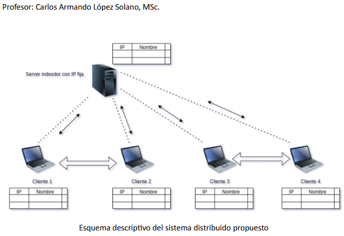

# PARCIAL 1

## Que hacer
Se pide desarrollar un sistema de software distribuido que mediante el uso de RPC permita la
negociación entre nodos de una red de usuarios en función de la colección de los números enteros
ordenados de 0 hasta 10. 

El sistema funciona de la siguiente manera: Un nodo entra en la red mediante su notificación ante un indexador el cual lo registra en una lista de nodos. Adicionalmente, el indexador le entrega una lista 11 números aleatorios en el rango de 0 a 10 para que este pueda negociar con otros nodos y pueda completar la colección de dichos números (de 0 a 10). La negociación con otros nodos se realiza mediante el intercambio de números buscando siempre completar la lista ordenada de los números enteros de 0 a 10 en cada uno de los nodos. El indexador tendrá la potestad de repartir a cada nodo un total de 11 números enteros (entre el rango de 0 a 10), los cuales pueden estar repetidos o no. Sin embargo, los números dados a los nodos debe permitir la negociación entre ellos para que cada uno pueda tener la colección completa de los números.

## Entregables
- El sistema con al menos 5 contenedores cliente funcionando y un contenedor servidor index.
  
- Deben usar la tecnología de RPC que permita la creación de comunicaciones bajo los criterios de la arquitectura Cliente-Servidor de acuerdo con las diferentes situaciones de comunicación requeridas.

## Esquema
